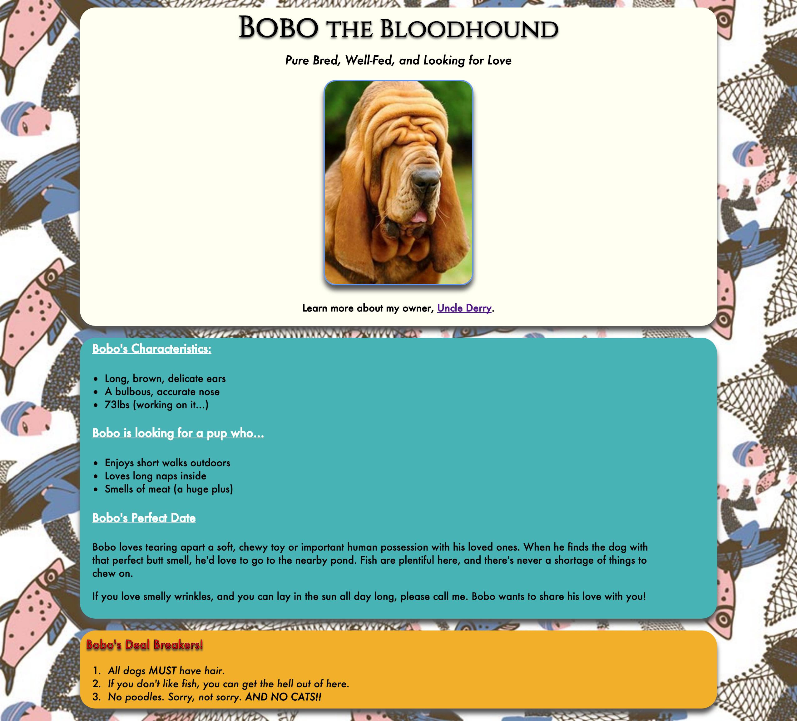

# Uncle Derry's Dog Needs a Date

## HTML/CSS Lab

My poor ol' Uncle Derry needs your help. I hate pushing him off on you guys
but he's just more annoying by the minute - constantly calling me about his
dang dog.

I get the feeling he's been projecting onto it again. He's determined he needs
to help his pup, Bobo, find someone special.

Living alone near a pond more sewage than water leads you to do some crazy
things, but it also affords you a lot of thinking time, and poor ol' Uncle Derry
has been trying to build website with those lonely hours.

While this seems like a positive use of time, ever since he found out I was a
web developer, he's been *hounding* me for help. Now he needs me to him find
other find other dog's dating profiles - it's time to make some dog dating
webpages!

#### Final Result

At the end of this lab, your page might resemble something like this:

**Make dating options and/or competition profiles for Uncle Derry's Dog.**

We just need him to believe other dogs are out there.

## Lab

This lab will happen in 3 steps.

1. Create profile website. (40 minutes)
2. Trade webpages with your neighbor. Constructively critique the site, help
   with syntax, and point out what was confusing. (10 minutes)
3. Discuss what you found. (5 minutes)

### Part 1 - Create Profile Website (40 Minutes)

**Using HTML & CSS, build a webpage.** The webpage must have:

- a `<head>`
- the necessary metadata for the head: `meta` tags, `title`, etc.
- a `<body>` with well-structured content, including semantic HTML tags

#### HTML Content

For your HTML content, you must have:

- A page title with a top heading (e.g. Bobo the Bloodhound), and a secondary
  heading (e.g. Pure Bred, Well-fed and Looking for Love)
- Images and at least one link
- Two lists
  - Attributes of your pup
  - Attributes of what your pup is looking for
- Explain a perfect date in at least two paragraphs
- Emphasize deal breakers!
- Use comments to divide the sections to assist your neighbor (e.g.
  `<!-- Deal Breakers -->`)

#### CSS

In your CSS, please incorporate:

- Classes for grouped items
- **No** inline styling
- A separate stylesheet linked to your html page
- Place all stylesheets inside a `/css` directory
- Color and style to the text and background
- A Google Font

### Part 2 - Trade!

Read through your partner's code.

If you find mistakes, fix them, but write down what you do - **help each other
find the bugs!**

Use the following style guide to check the webpage:

**HTML**

- [ ] All necessary boilerplate (`<head>`, `<!DOCTYPE html>`, `<body>`, etc.)
- [ ] HTML structures separated by comments
- [ ] Semantic tags, both *structural* (e.g. `<footer>`, `<header>`, etc.) and *typographic* (`<strong>`, `<em>`, etc.)
- [ ] Indentation convention used is 2-space tabs
- [ ] All text surrounded by tags
- [ ] Appropriate attributes for html tags
	- [ ] `alt` for ``
	- [ ] `src` for ``
	- [ ] `href` for `<a>`
	- [ ] `href` for `<link>`

**CSS**

- [ ] Clear syntax
- [ ] Clear use of classes
- [ ] No ids
- [ ] Legible styling
- [ ] If using CSS Inheritance, it is easily readable

### Part 3 - Discuss

Tell your partner what you found, especially the parts you liked and the parts
you found difficult to understand in their code. Remember to be specific! Think:

- Which section was difficult to understand?
- How could they have improved their naming conventions or tag use?
- What element of the code prompted your confusion?

## Show Off Your Pup Profile!

You've done great work in the land of pup love!

More than that you're making this pup extremely happy… or, at the very least,
his lugubrious owner think he is. Be sure to see if your pup matches with
anyone else the class!
