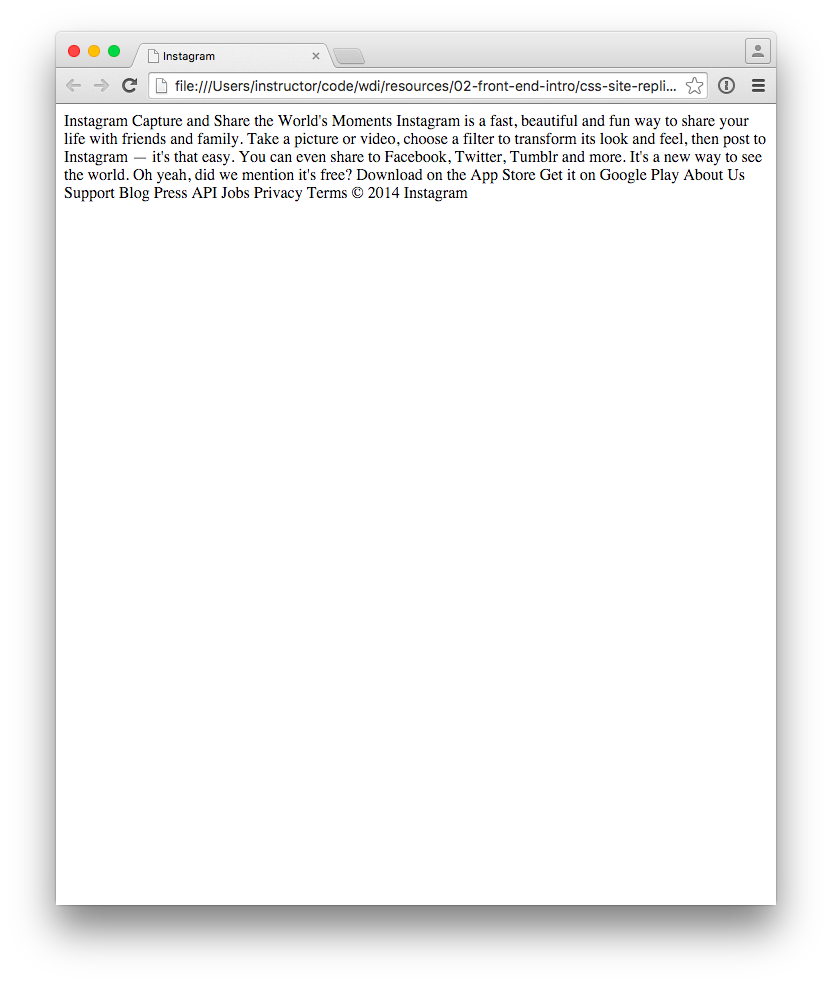

# CSS Positioning

## Introduction

The best way to learn CSS is by doing, and the best way to do CSS is to 
write your CSS _towards_ something. To that end, we're going to go from 
a mockup of Instagram's former landing page, and turn that mockup into 
living, breathing HTML and CSS.

#### Deliverable

##### Before

Here's what we're starting with:

##### After

We're going to be turning it into this:

(Or as close as we can get; seriously, if you get 80% of the way there, 
that's reason to feel immensely proud!)

## Exercise

#### Requirements

- Take the blob of text and mark it up using semantic HTML (hint: note 
  what goes in a rectangle together– those probably belong in the same 
  element).
- Use `position`, `float`, and [clear][clear] to position elements on 
  the page.
- Look up and use CSS properties and values that may not have been 
  covered in class, for example:
  - `background: url("../images/link_to_image.png")` 
  - `list-style`
  - `text-decoration`
  - `text-transform`
- Use a single external CSS stylesheet to style all pages.
- Use the images provided to construct the appropriate elements on the 
  page:
  - the iPhone
  - App Store and Google Play buttons
  - Instagram Logo
  - Login button

#### Starter code

The starter-code contains all the files, images, and text content needed
to create the page. The text is in the `index.html`, and the color 
palette is in `main.css`

## Additional Resources

- [CSS Reference from MDN][mdn-css]

<!-- LINKS -->

[clear]:   https://developer.mozilla.org/en-US/docs/Web/CSS/clear
[mdn-css]: https://developer.mozilla.org/en-US/docs/Web/CSS
